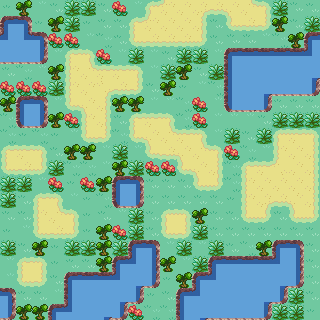

# **Map Generator**

This program generates a bitmap of your choice when entering a set of tiles. 
  

  

### **Algorithm**
The algorithm is comparable to solving a sudoku.  
<ol>
    <li>Each spot on the grid has the possibility to collapse to n amount of tiles.</li>
    <li>When the user clicks on a cell, that spot collapses to a single possible tile, meaning; one of the sprites will appear in that cell.</li>
    <li>The grid will update the possibilities around that cell, they have collapsed further.</li>
    <li>The program will now look for a cell which is not yet fully collapsed, but still has multiple possible sprites to draw. (Taking adjacency rules into consideration)</li>
    <li>One of these gets chosen to collapse.</li>
    <li>The program goes back to step 5, unless the entire grid has collapsed OR if the pattern results in impossible tiles, meaning; a cell without any possible sprites because of its adjacency rules.</li>
</ol>

### **Manual**
In order to do this, you need a set of tiles of the same width and height. These can be placed in the tiles folder. The adjacency rules need to be edited in the json file "nb_rules.json" in the same way the current set of tiles is described. The eight adjacent neighbours need to be clarified for each tile.